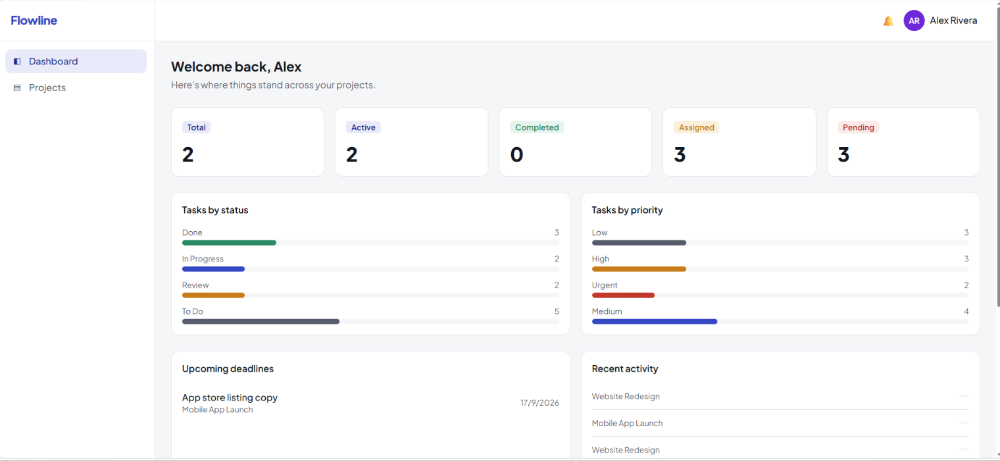
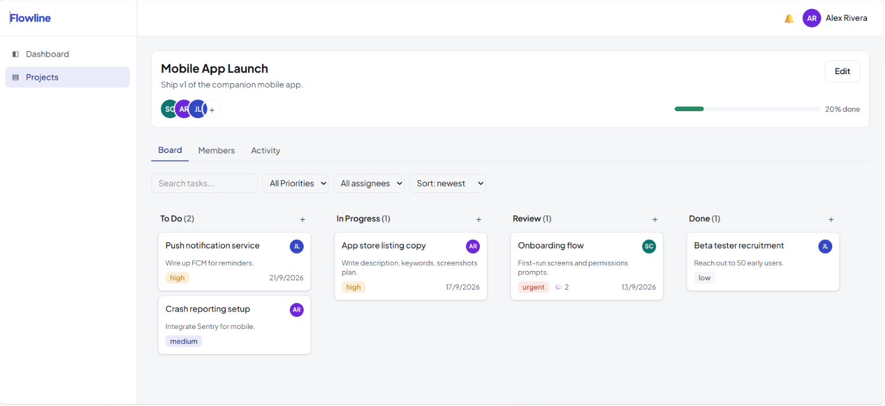
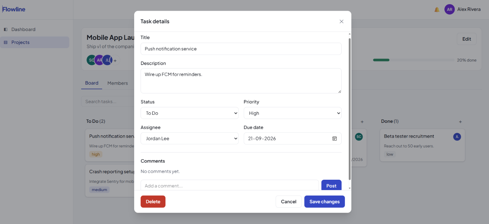
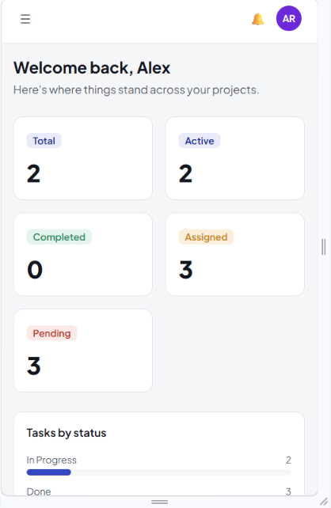

# Flowline — Project Management Tool

Trello/Asana-style project management app. Built for the CodeAlpha Full Stack Development Internship.

MERN stack: React/Vite/Tailwind frontend, Node/Express/MongoDB backend, JWT auth, real-time updates via Socket.IO.

## Features

- Auth: register/login, JWT, protected routes, persistent session
- Dashboard: stats, status/priority breakdown, upcoming deadlines, recent activity
- Projects: create/edit/delete, members, deadlines, search
- Kanban board: drag-and-drop status updates, filters, search, sort
- Tasks: priority, assignee, due date, comment count, full detail modal
- Comments: post/edit/delete own, conversation style
- Activity feed per project (Board / Members / Activity tabs)
- In-app notifications: bell, unread count, mark read
- Real-time sync across clients (tasks, comments, activity, notifications)
- Toast notifications, loading/empty/error states
- Fully responsive: mobile, tablet, desktop

## Screenshots

| Dashboard | Kanban Board |
|---|---|
|  |  |

| Task Details | Mobile View |
|---|---|
|  |  |

## Tech Stack

| Layer     | Tech |
|-----------|------|
| Frontend  | React 19, Vite, Tailwind CSS v4, React Router, Axios, React Hook Form, Socket.IO client |
| Backend   | Node.js, Express, MongoDB + Mongoose, JWT, bcryptjs, Socket.IO, express-rate-limit |

## Architecture

```
codealpha_tasks-1/
  client/       # React/Vite frontend — see client/README.md
  server/       # Express/MongoDB backend — see server/README.md
  *.png         # App screenshots used in this README
```

Each side has its own README with full setup, env vars, and API details.

## Quick Start

```bash
# Backend
cd server
npm install
cp .env.example .env      # fill MONGO_URI + JWT_SECRET
npm run seed               # demo data: 2 projects, 12 tasks, 4 users
npm run dev

# Frontend (separate terminal)
cd client
npm install
cp .env.example .env
npm run dev
```

Backend runs on `:5000`, frontend on `:5173`.

## Demo Credentials

Run `npm run seed` in `server/`, then log in with:

| Email             | Password      |
|-------------------|---------------|
| alex@demo.com     | password123   |
| sam@demo.com      | password123   |
| jordan@demo.com   | password123   |
| priya@demo.com    | password123   |

## API Overview

Full endpoint list in `server/README.md`. Summary: `/api/auth`, `/api/users`, `/api/projects`, `/api/tasks`, `/api/comments`, `/api/dashboard`, `/api/notifications`.

## Deployment

- Backend: Render, Railway, or Fly.io (Node host)
- Frontend: Vercel or Netlify (static build)
- See each folder's README for env vars and CORS notes.

## Future Improvements

- File attachments on tasks
- Rich text in descriptions/comments
- Role-based permissions beyond owner/member

## Author

Himanshu — B.Tech CSE, Global Institute of Technology and Management, Gurugram. CodeAlpha Full Stack Development Internship.

[GitHub](https://github.com/himanshuchauhan08072004-star) · [LinkedIn](https://linkedin.com/in/himanshuchauhan08)
